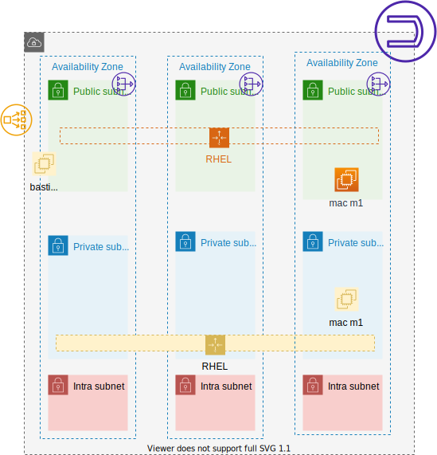

# qenvs

automation for qe environments using pulumi

[](https://quay.io/repository/ariobolo/qenvs)

## Environment

Create a composable environment with different qe target machines aggregated on different topologies and with specific setups (like vpns, proxys, airgaps,...)

Current available features using cmd `qenvs corp create`



## Spot price use case

The purpose for this PoC with pulumi is to get the best price for bid a spot machine. The solution will check  
the prices for a set of instances types based on a product description filter.

It will return the best price, reporting also the instance type and the availability zone for getting the price.  

The outcome price of this solution will be passed as parameter to a second stack, where the vm will be requested as spot instance based 
on that price, notice price is not enough, other parameters should be aligned (region and Az).  

## Usage

```bash
podman run -d --name spot \
        -e AWS_ACCESS_KEY_ID=${AWS_ACCESS_KEY_ID} \
        -e AWS_SECRET_ACCESS_KEY=${AWS_SECRET_ACCESS_KEY} \
        -e AWS_DEFAULT_REGION=${AWS_DEFAULT_REGION} \
        -e PULUMI_CONFIG_PASSPHRASE=sample_passphrase \
        -e INSTANCE_TYPES='m5dn.metal,m5d.metal' \
        -e PRODUCT_DESCRIPTION=Windows \
        quay.io/ariobolo/qenvs:0.0.1
```
