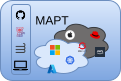

<div align="center">

# 

### Multi Architecture Provisioning Tool

**Spin up cloud machines in seconds. Tear them down just as fast.**  
Spot pricing. Airgap topologies. CI/CD native. Built for operators.

[](https://github.com/redhat-developer/mapt/actions/workflows/build-go.yaml)
[](https://github.com/redhat-developer/mapt/actions/workflows/build-oci.yaml)
[](LICENSE)

</div>

---

## What is mapt?

`mapt` is a command-line tool for provisioning and destroying cloud test environments across **AWS**, **Azure**, and **IBM Cloud**. It wraps the complexity of multi-cloud infrastructure into a single, consistent interface — optimized for cost, speed, and CI/CD integration out of the box.

```
mapt <provider> <target> <create|destroy> [flags]
```

One pattern. Every cloud. Every OS.

---

## Quickstart

Pull the container and provision a RHEL machine on AWS spot in one command:

```bash
podman run -d --name mapt-rhel \
    -v ${PWD}:/workspace:z \
    -e AWS_ACCESS_KEY_ID=<key> \
    -e AWS_SECRET_ACCESS_KEY=<secret> \
    -e AWS_DEFAULT_REGION=us-east-1 \
    quay.io/redhat-developer/mapt:latest aws rhel create \
        --project-name my-rhel \
        --backed-url file:///workspace \
        --rh-subscription-username <user> \
        --rh-subscription-password <pass> \
        --conn-details-output /workspace \
        --spot
```

Connection details land at `${PWD}/host`, `${PWD}/username`, and `${PWD}/id_rsa`. Destroy with the same flags, swapping `create` for `destroy`.

---

## What can you provision?

### Instances

| Target | AWS | Azure | IBM Cloud |
|--------|:---:|:-----:|:---------:|
| **macOS** (x86, M1, M2) | [docs](docs/aws/mac.md) | — | — |
| **Windows Server** (nested virt) | [docs](docs/aws/windows.md) | — | — |
| **Windows Desktop** | — | [docs](docs/azure/windows.md) | — |
| **RHEL** | [docs](docs/aws/rhel.md) | [docs](docs/azure/rhel.md) | — |
| **RHEL AI** | [docs](docs/aws/rhelai.md) | [docs](docs/azure/rhelai.md) | — |
| **Fedora** | [docs](docs/aws/fedora.md) | [docs](docs/azure/fedora.md) | — |
| **Ubuntu** | — | [docs](docs/azure/ubuntu.md) | — |
| **IBM Z** (s390x) | — | — | [docs](docs/ibmcloud/ibm-z.md) |
| **IBM Power** (ppc64le) | — | — | [docs](docs/ibmcloud/ibm-power.md) |
| **Gaudi** (accelerator) | — | — | [docs](docs/ibmcloud/ibm-gaudi.md) |

### Managed Services

| Service | Provider | Description |
|---------|----------|-------------|
| **EKS** | AWS | Kubernetes cluster with spot node groups |
| **AKS** | Azure | Kubernetes cluster |
| **OpenShift SNC** | AWS | Single-node cluster for local testing |
| **Kind** | AWS | Lightweight Kubernetes via Kind |
| **Mac-Pool** | AWS | Shared Mac host — amortize the 24h minimum across workloads |

---

## Key features

### Spot-optimized provisioning

mapt selects the best region for your spot instance by balancing **cost vs. availability** across the provider's fleet — no manual region hunting. When a spot-friendly region doesn't have the instance you need, mapt automatically falls back to another.

```bash
mapt aws rhel create --spot --arch arm64 --cpus 8 --memory 64 \
    --project-name my-rhel --backed-url file:///workspace \
    --conn-details-output /workspace
```

### Hardware-spec instance selection

Describe the machine you need; mapt picks the right instance type. No more looking up EC2/Azure SKU tables.

```bash
# Give me an arm64 machine with 4 CPUs and 16 GB RAM
mapt azure fedora create \
    --arch arm64 --cpus 4 --memory 16 \
    --project-name fedora-arm --backed-url file:///workspace \
    --conn-details-output /workspace
```

Flags: `--arch`, `--cpus`, `--memory`, `--nested-virt`, `--vm-types`  
Details: [instance selection docs](docs/instance-selection.md)

### Airgap topology

Provision an isolated machine with a jump bastion. mapt wires up the full network topology — you get bastion connection details alongside the target host.

```bash
mapt aws rhel create --airgap \
    --project-name rhel-airgap --backed-url file:///workspace \
    --conn-details-output /workspace
```

Outputs: `host`, `username`, `id_rsa`, `bastion_host`, `bastion_username`, `bastion_id_rsa`

### Serverless mode (self-destruct timer)

Run mapt itself on Fargate (AWS) or Azure Container Instances and set a `--timeout`. If the destroy operation never runs — pipeline crash, lost state, whatever — the infrastructure tears itself down automatically. No orphaned resources, no surprise bills.

Details: [serverless mode docs](docs/serverless-mode.md)

---

## CI/CD integrations

mapt machines register themselves with your CI system at provision time — nothing to configure after the fact.

### GitHub Actions self-hosted runner

```bash
# Recommended: GitHub App (no long-lived credentials)
mapt aws rhel create --spot \
    --install-ghactions-runner \
    --ghactions-runner-repo "https://github.com/your-org/your-repo" \
    --ghactions-app-id "123456" \
    --ghactions-app-installation-id "789012" \
    --ghactions-app-private-key "/path/to/private-key.pem" \
    --project-name rhel-runner --backed-url file:///workspace \
    --conn-details-output /workspace
```

Also supported: PAT (`GITHUB_TOKEN` env var) and pre-generated registration tokens.  
Supported targets: AWS (Windows, RHEL, Fedora, macOS) · Azure (Windows, RHEL) · IBM Cloud (ppc64le, s390x)  
Details: [self-hosted runner docs](docs/self-hosted-runner.md)

### Cirrus CI persistent worker

```bash
mapt aws rhel create --spot \
    --cirrus-persistent-worker-token <token> \
    --cirrus-persistent-worker-labels arch=x86_64,os=rhel \
    --project-name rhel-cirrus --backed-url file:///workspace \
    --conn-details-output /workspace
```

### GitLab Runner

```bash
mapt aws rhel create --spot \
    --gitlab-runner-token <token> \
    --project-name rhel-gitlab --backed-url file:///workspace \
    --conn-details-output /workspace
```

Details: [GitLab runner docs](docs/gitlab-runner.md)

### Tekton tasks

Tekton tasks for dynamic provisioning inside pipelines are available in the [`tkn/`](tkn) directory.

---

## Running mapt

### Container (recommended)

```bash
# Create
podman run -d --name mapt \
    -v ${PWD}:/workspace:z \
    -e AWS_ACCESS_KEY_ID=<key> \
    -e AWS_SECRET_ACCESS_KEY=<secret> \
    -e AWS_DEFAULT_REGION=us-east-1 \
    quay.io/redhat-developer/mapt:latest aws rhel create \
        --project-name my-env \
        --backed-url file:///workspace \
        --conn-details-output /workspace

# Destroy (same flags, swap create → destroy)
podman run --rm \
    -v ${PWD}:/workspace:z \
    -e AWS_ACCESS_KEY_ID=<key> \
    -e AWS_SECRET_ACCESS_KEY=<secret> \
    -e AWS_DEFAULT_REGION=us-east-1 \
    quay.io/redhat-developer/mapt:latest aws rhel destroy \
        --project-name my-env \
        --backed-url file:///workspace
```

The `--backed-url` volume mount holds your stack state. Keep it — you need it to destroy.

### Binary

```bash
go install github.com/redhat-developer/mapt/cmd/mapt@latest
mapt --help
```

---

## Architecture support

| Architecture | Providers |
|---|---|
| x86_64 | AWS, Azure |
| arm64 | AWS, Azure |
| s390x (IBM Z) | IBM Cloud |
| ppc64le (IBM Power) | IBM Cloud |
| Gaudi (accelerator) | IBM Cloud |

---

## State management

mapt uses [Pulumi](https://www.pulumi.com/) under the hood. Stack state is stored at `--backed-url`:

- **Local**: `file:///absolute/path` — simplest, works for local testing
- **S3**: `s3://your-bucket` — required for serverless mode and shared CI use

The `--project-name` flag namespaces stacks, so you can run multiple environments from the same bucket.

---

<div align="center">

**[AWS docs](docs/aws.md)** · **[Azure docs](docs/azure)** · **[IBM Cloud docs](docs/ibmcloud)** · **[Changelog](CHANGELOG.md)**

</div>
